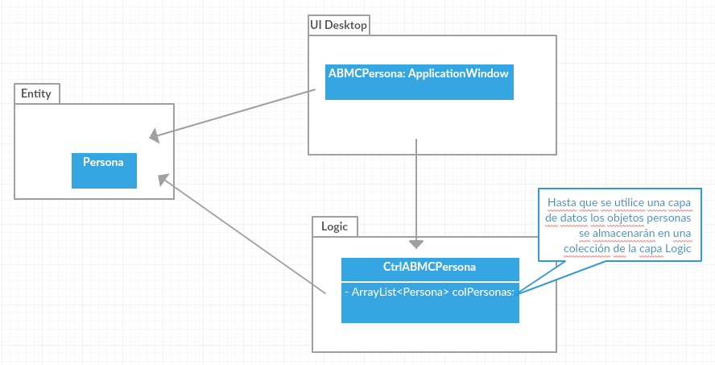

# Enunciados

**Ejercicio 1**

Leer 10 datos numéricos y mostrarlos en orden inverso

**Ejercicio 2**

Leer un entero y luego una lista de 20 enteros. Guardar los mayores al número inicial y mostrarlos al final  

**Ejercicio 3**

De acuerdo al diagrama de clases resolver:

Cargar una lista de empleados (máximo 20) preguntado en cada uno si son administrativos o vendedores y cargar todos los datos respectivos.

Luego listar los empleados indicando: dni, nombre, apellido y sueldo.
El sueldo debe calcularse en el método getSueldo() de la siguiente forma:
* Si es administrativo: sueldoBase \* ((hsExtra \* 1.5)+hsMes) / hsMes
* Si es vendedor: sueldoBase + (porcenComision\*totalVtas/100)

Usar un Array de tipo empleado para resolver este ejercicio.

**Ejercicio 4**

Resolver los ejercicios 2 y 3 utilizando ArrayList en lugar de arrays.

**Ejercicio 5**
ABMC simple de personas

Crear un ABMC simple para personas según las siguientes características:

* Hacer una interfaz de usuario de escritorio con Swing.
* De las personas debe registrarse: Nombre, Apellido, DNI y habilitado (estado booleano)
* El desarrollo se hará teniendo en cuenta el uso de capas como se muestra en la imagen del Equema de Capas. Por ahora sólo se utilizarán las capas de Entidades, Lógica y UI.

Crear la solución teniendo en cuenta estos 4 elementos:

1. Sin métodos ni variables estáticas (excepto el main).
2. No programar lógica dentro de los eventos de los botones, allí simplemente invocar a un método del JFrame.
3. Minimizar el código de lógica dentro del JFrame.
4. Entre el JFrame y el Controlador intercambiar objetos de la capa Entidades y excepciones.
